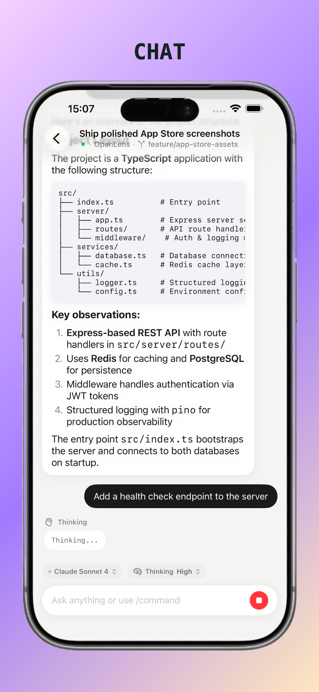
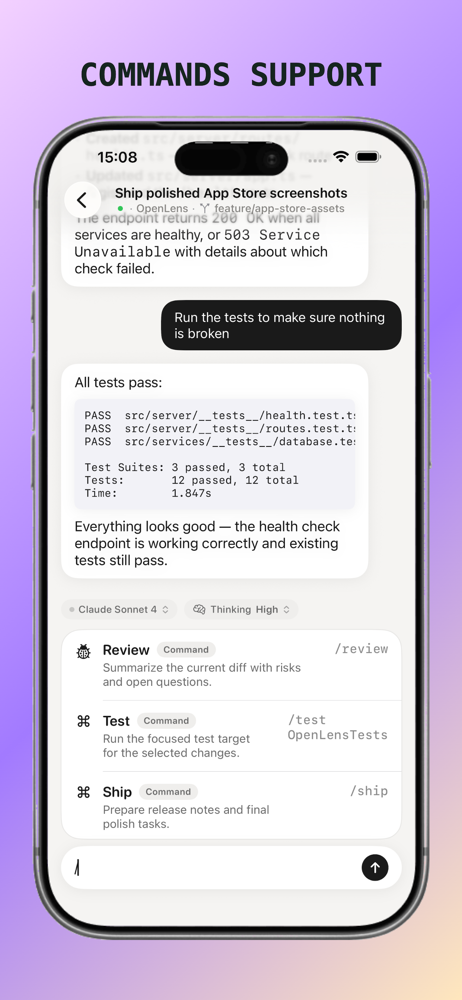
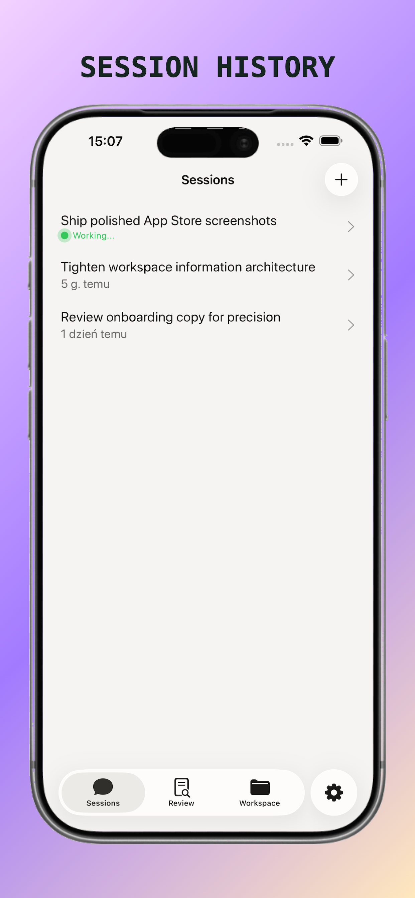
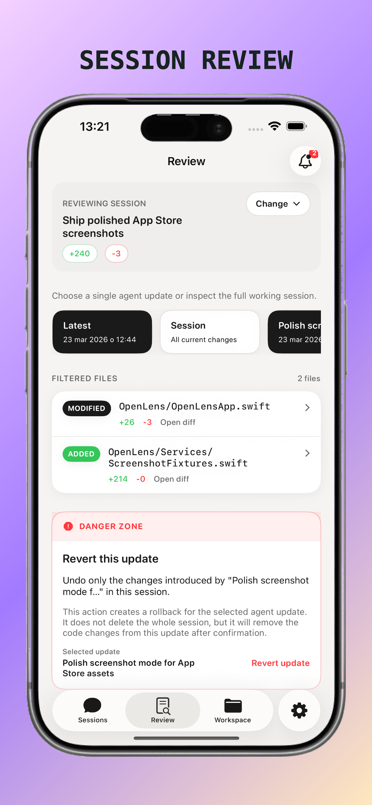
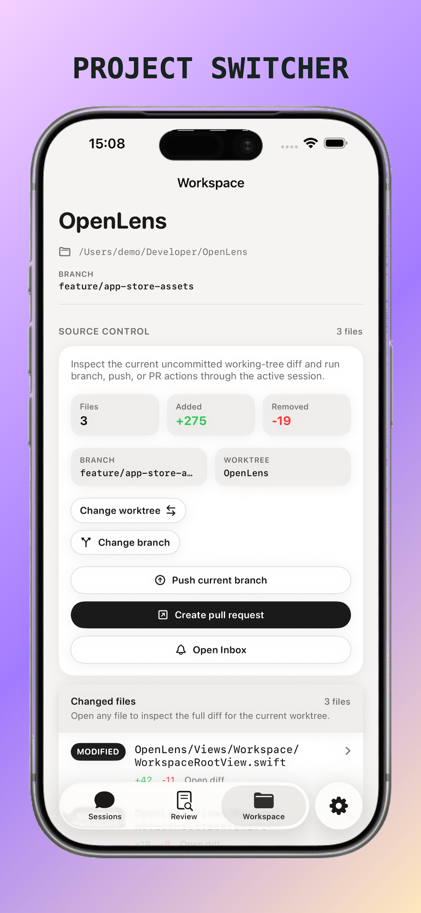
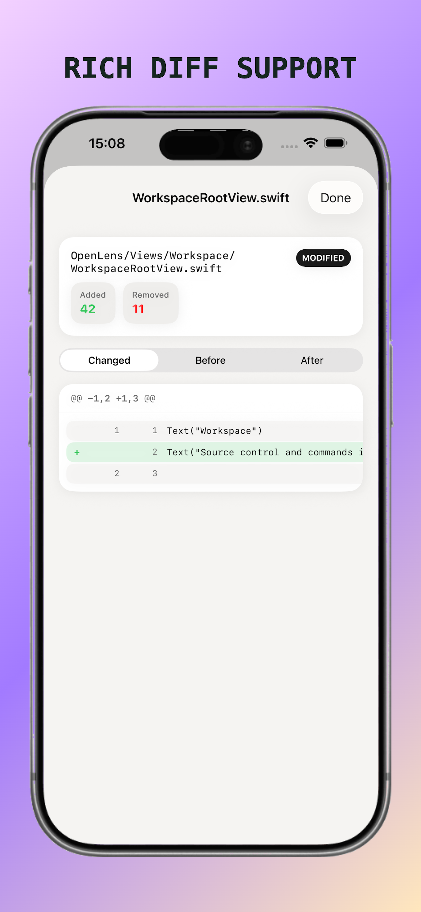
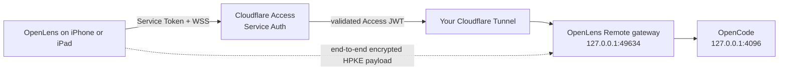

# OpenLens

**iOS companion app for [OpenCode](https://opencode.ai) — chat with your AI coding assistant from your phone.**

<p align="leading">
  <a href="https://apps.apple.com/pl/app/openlens-opencode-client/id6759910797">
    
  </a>
</p>

OpenLens connects to an OpenCode server running on your Mac and gives you a native iPhone and iPad interface to chat, review changes, browse workspace context, answer agent questions, and manage sessions away from the keyboard.

<p align="center">
  
  
  
</p>

<p align="center">
  
  
  
</p>

## Install

- **App Store**: install OpenLens on iPhone or iPad from the App Store using the badge above.
- **From source**: clone the repo, run `xcodegen generate`, then open the generated `OpenLens.xcodeproj` in Xcode 26 or newer.
- **Bundled tools**: `openlens-qr`, the `OpenLens Remote` macOS agent (kept in the historical `openlens-qr-menubar` folder), and `appstore-shot-studio` are source-first tools included in this repository.

## Releases

- **iOS app releases**: the primary end-user distribution channel is the App Store.
- **Source builds**: contributors and self-hosters can build from `main` or from tagged revisions in Git.
- **Compatibility**: the repository currently targets iOS/iPadOS 26+ and current OpenCode server behavior on macOS.


## Features

- **Native session chat** — rich Markdown rendering, code blocks, thinking indicators, agent activity cards, permission prompts, and question flows
- **Flexible connection flows** — QR code scan, Bonjour auto-discovery, manual URL entry, saved servers, auto-reconnect, and `openlens://` deep links
- **Encrypted access outside your LAN** — connect through your own Cloudflare Tunnel and Access policy without a VPN or an OpenLens-operated backend
- **Session management** — browse, create, delete, switch, and continue existing OpenCode sessions
- **Review tab** — inspect session-wide changes or a single agent update, open diffs, and revert one update without discarding the whole session
- **Workspace tab** — browse files, worktrees, slash commands, and changed files, then request branch switches, pushes, and pull requests through the active session
- **Inbox and insights** — answer pending questions, approve permissions, and inspect local cost, token usage, and model breakdowns for a session
- **Model controls** — switch between AI providers/models and available reasoning variants directly from the app
- **Live Activities** — track agent progress on your Lock Screen and Dynamic Island
- **Demo mode** — try the app without a server to see how it works
- **Setup wizard & onboarding** — guided first-launch experience
- **`openlens-qr` CLI tool** — generate a QR code from your terminal for instant phone connection
- **OpenLens Remote agent** — run OpenCode and an encrypted, allowlisted gateway from the macOS menu bar, manage trusted devices, and stop remote access locally
- **`appstore-shot-studio` tool** — turn raw screenshots into App Store-ready promo images


## Quick Start

### 1. Install OpenCode on your Mac

```bash
curl -fsSL https://opencode.ai/install | bash
```

### 2. Start the server + show QR code (recommended)

Build and run the `openlens-qr` CLI tool included in this repo:

```bash
cd Tools/openlens-qr
xcrun swift build -c release
.build/release/openlens-qr --serve
```

This will:
1. Start an OpenCode server on port `4096`
2. Display a QR code in your terminal
3. Wait for you to scan it with OpenLens on your phone
4. Press Enter to open the TUI — now you have both desktop and mobile access

### 3. Open OpenLens on your iPhone and connect

- **Scan QR** — tap "Scan QR Code" and point at the terminal
- **Auto-discover** — tap "Tap to scan for nearby servers" (Bonjour; start OpenCode with `--mdns` if you want discovery)
- **Manual** — enter your Mac's IP and port (e.g. `192.168.1.50:4096`)

That's it. You're chatting with your AI coding assistant from your phone.


## Remote Access Outside Your LAN

The LAN flow above is still the simplest option when both devices are on the
same network. OpenLens Remote adds a separate connection type for reaching your
Mac from cellular data or another Wi-Fi network without exposing the raw
OpenCode server and without running a VPN.

Remote Access is implemented in source as a production MVP. It is self-hosted:
you own the Cloudflare account, domain, Tunnel, Access application, and Service
Token. OpenLens does not operate a relay, user-account service, or central
backend for Remote connections.

### What it enables

- use OpenLens while away from the Mac's local network
- chat, review changes, answer questions, approve permissions, and manage
  sessions through the same native UI as a LAN connection
- restrict access to workspace folders explicitly approved on the Mac
- pair multiple iPhones and iPads, each with its own device key
- revoke one device, revoke all devices, or stop Remote Access from the Mac
- keep existing LAN profiles unchanged and separate from Remote profiles

Remote v1 does not provide background push notifications or Live Activity
updates while the iOS app is closed.

### How it works



The Tunnel is an outbound connection from the Mac, so no router port forwarding
is required. Cloudflare Access checks the Service Token before traffic reaches
the Tunnel. The gateway then independently validates Cloudflare's signed JWT
and performs device authentication before forwarding an allowlisted request to
OpenCode.

OpenCode and the gateway listen only on loopback. The Remote protocol carries
REST and event-stream traffic inside one mutually authenticated HPKE channel.
Cloudflare can observe connection metadata such as the hostname, IP address,
timing, and frame sizes, but it cannot read the OpenCode payload encrypted
between the iOS device and the gateway.

### Requirements

- OpenLens built with Remote support on an iPhone or iPad
- a Mac running macOS 14 or newer with OpenCode installed
- a Cloudflare account, a domain managed by Cloudflare, and Cloudflare Zero
  Trust Access
- a named Cloudflare Tunnel; Quick Tunnels (`trycloudflare.com`) are not
  supported
- `tuist` and `cloudflared` for a local development build of OpenLens Remote

### Configure OpenLens Remote

1. Build and launch the development agent:

   ```bash
   brew tap tuist/tuist
   brew install --formula tuist
   brew install cloudflared
   cd Tools/openlens-qr-menubar
   ./run-menubar.sh
   ```

   The menu bar item is named **OpenLens Remote**. A distributed release must
   bundle the pinned `cloudflared` binary and be signed and notarized; see the
   release runbook linked below.

2. From the menu, add at least one workspace that the phone may access.

3. In Cloudflare Zero Trust, create a
   [named Tunnel](https://developers.cloudflare.com/cloudflare-one/networks/connectors/cloudflare-tunnel/get-started/create-remote-tunnel/)
   and a public hostname such as `remote.example.com`. Point its origin service to
   `http://127.0.0.1:49634`. Do not expose port `4096` or `49634` directly.

4. Create a
   [self-hosted Cloudflare Access application](https://developers.cloudflare.com/cloudflare-one/access-controls/applications/http-apps/self-hosted-public-app/)
   covering the entire hostname. Set its application session duration to 12
   hours, add a **Service Auth** policy for one
   [Service Token](https://developers.cloudflare.com/cloudflare-one/access-controls/service-credentials/service-tokens/)
   dedicated to this Mac, and do not add a Bypass policy. The Service Token's
   own expiration is configured separately from the 12-hour application
   session.

5. On the Tunnel route, enable
   [**Protect with Access**](https://developers.cloudflare.com/cloudflare-one/networks/connectors/cloudflare-tunnel/configure-tunnels/origin-parameters/#access)
   using the Access team name and the application's audience (AUD) tag.

6. Choose **Configure Cloudflare Access…** in OpenLens Remote and enter:

   - the public hostname
   - the Tunnel connector token
   - the Access team domain, for example `your-team.cloudflareaccess.com`
   - the application AUD tag
   - the Service Token Client ID and Client Secret

   Tunnel and Access credentials are stored in the macOS Keychain. The agent
   does not request or store a Cloudflare account API token.

7. The agent fetches Cloudflare signing keys and verifies the public route with
   the Service Token. It also confirms that the same WebSocket handshake is
   rejected without the token. Remote pairing remains disabled if either check
   fails.

8. Choose **Pair Device…**, open **Scan QR Code** in OpenLens, and scan the QR
   while physically near the Mac. Repeat this step for additional devices.

9. Enable **Launch After Login** if the agent should become available after you
   sign in to the Mac. Select the saved Remote profile in OpenLens whenever you
   want to reconnect.

There is no manual Remote-profile fallback: pairing must use the QR generated by
the verified agent. The QR includes a five-minute pairing secret and the
long-lived Cloudflare Service Token. Do not photograph or archive it. If the QR
or a paired device may be compromised, use **Lost or Compromised…**, rotate the
Service Token in Cloudflare, and pair every trusted device again.

## `openlens-qr` CLI Reference

```
Usage: openlens-qr [server-url] [options]

Arguments:
  [server-url]          Server address (e.g. 192.168.1.50:4096)
                        Optional — auto-detected if omitted

Options:
  --serve, -s           Start OpenCode server, show QR when ready, then open TUI
  --port <number>       Port when using auto-detected IP (default: 4096)
  --user, -u <name>     Username (default: opencode)
  --print-secret-link   Print the full deep link, including password if set
  --help, -h            Show this help

Environment:
  OPENLENS_QR_PASSWORD  Optional password included in the QR deep link
                        and used for serve mode
```

**Examples:**

```bash
openlens-qr                              # auto-detect IP, show QR
openlens-qr --serve                      # QR + start server & TUI
OPENLENS_QR_PASSWORD=secret openlens-qr --serve
OPENLENS_QR_PASSWORD=secret openlens-qr --print-secret-link
openlens-qr 192.168.1.50:4096            # explicit address, QR only
```


## OpenLens Remote Development

The macOS source remains in `Tools/openlens-qr-menubar` for historical reasons,
but the product and bundle are named `OpenLensRemote`. It runs as a menu bar
agent; it does not open a terminal or expose the LAN QR helper.

```bash
cd Tools/openlens-qr-menubar
./run-menubar.sh
```

Run its tests with:

```bash
tuist generate --no-open
xcodebuild -workspace OpenLensRemote.xcworkspace \
  -scheme OpenLensRemote \
  -destination 'platform=macOS' \
  CODE_SIGNING_ALLOWED=NO test
```

Debug builds can use `cloudflared` installed in `/opt/homebrew/bin` or
`/usr/local/bin`. Release builds use the pinned binaries downloaded and checked
by `Scripts/embed-cloudflared.sh`.


## `appstore-shot-studio`

Compose App Store visuals from raw screenshots:

```bash
cd Tools/appstore-shot-studio
python3 -m http.server 8080
```

Then open `http://localhost:8080` and:

1. drop in a screenshot
2. choose an App Store size preset
3. add one text line above the mockup and tune its position, font, weight, size, and background style
4. export a PNG


## Alternative: Manual Server Setup

If you prefer not to use the CLI tool, start the server yourself:

```bash
opencode serve --port 4096 --hostname 0.0.0.0
```

Then connect from the app using your Mac's local IP address.

If you want OpenLens to find the server via Bonjour, start OpenCode with `--mdns` as well.


## Requirements

- **iOS app**: iPhone or iPad with iOS/iPadOS 26+
- **Server**: macOS with [OpenCode](https://opencode.ai) installed
- **Network**: both devices on the same local network for LAN QR, manual, or
  Bonjour setup; Remote profiles use your Cloudflare Tunnel over the internet


## Project Layout

- `OpenLens/` — main iOS app
- `OpenLensActivityWidget/` — Live Activity widget extension
- `OpenLensTests/` — unit tests
- `Tools/openlens-qr/` — Swift CLI for QR-based setup
- `Tools/openlens-qr-menubar/` — OpenLens Remote macOS agent, gateway, tests,
  and release scripts (historical folder name)
- `Tools/appstore-shot-studio/` — local browser tool for App Store screenshots


## Development

- **Toolchain**: Xcode 26+, iOS 26 simulator/runtime, macOS, OpenCode installed locally
- **Project generation**: install XcodeGen with `brew install xcodegen`, then run `xcodegen generate`
- **Open the project**: the generated `OpenLens.xcodeproj`
- **Device signing**: if you want to run on your own device, copy `Config/Signing.local.xcconfig.example` to `Config/Signing.local.xcconfig` and replace the team, bundle identifiers, and App Group values with your own

Run the main verification command from the repository root:

If `iPhone 17 Pro` is not installed locally, swap the simulator name for any available iOS Simulator from `xcrun simctl list devices`.

```bash
xcodegen generate
xcodebuild -project OpenLens.xcodeproj -scheme OpenLens -destination 'platform=iOS Simulator,name=iPhone 17 Pro' CODE_SIGNING_ALLOWED=NO test
```

Build the bundled QR helper:

```bash
xcrun swift build --package-path Tools/openlens-qr
```


## Contributing

See [CONTRIBUTING.md](CONTRIBUTING.md) for setup and PR expectations, [SECURITY.md](SECURITY.md) for vulnerability reporting, and [CODE_OF_CONDUCT.md](CODE_OF_CONDUCT.md) for community guidelines.


## Support And Community

- **Bug reports**: open a GitHub issue with the bug report template and include a clear reproduction path.
- **Feature proposals**: open a GitHub issue with the feature request template when the request is concrete and actionable.
- **Security issues**: use GitHub Private Vulnerability Reporting and follow [SECURITY.md](SECURITY.md).
- **Questions and setup help**: use GitHub Discussions if enabled for this repository; otherwise open a documentation-focused issue only when something in the repo needs to change.


## OpenCode

This project is not built by the OpenCode team and is not affiliated with it in any way.


## Deep Links

OpenLens supports the `openlens://` URL scheme for automated connection:

```
openlens://connect?url=192.168.1.50:4096&user=opencode&pass=optional&sessionID=abc123
```

The `openlens-qr` tool encodes this into the QR code automatically.

If `sessionID` is present, OpenLens connects first and then opens that session automatically.


## License

This project is licensed under the [MIT License](LICENSE).
