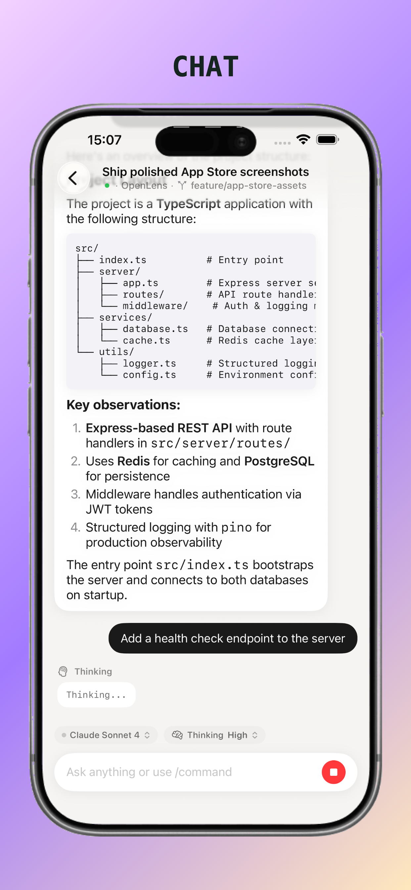
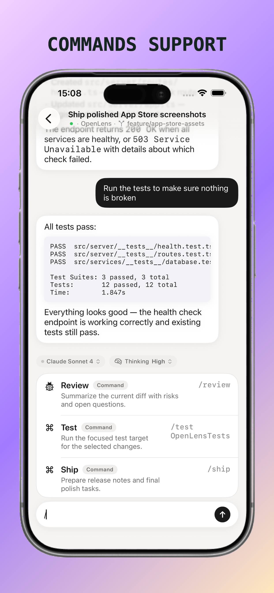
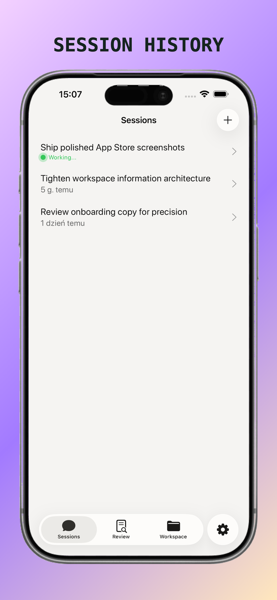
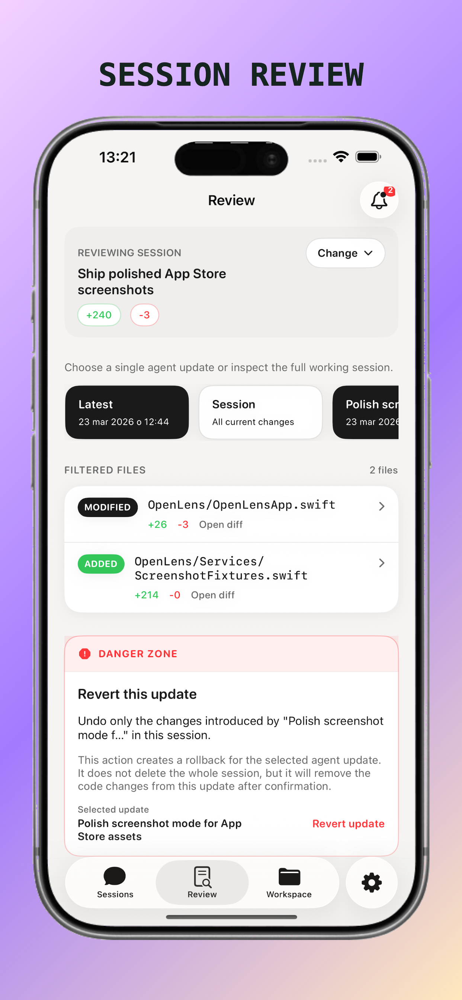
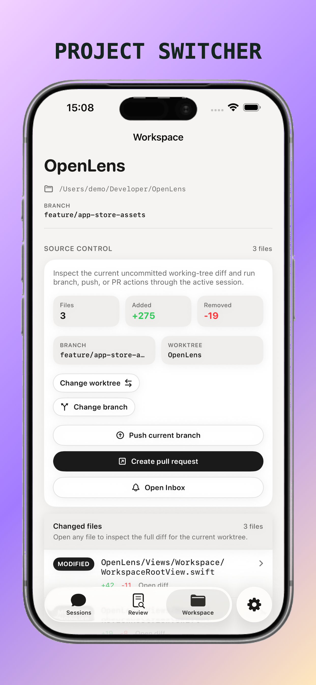
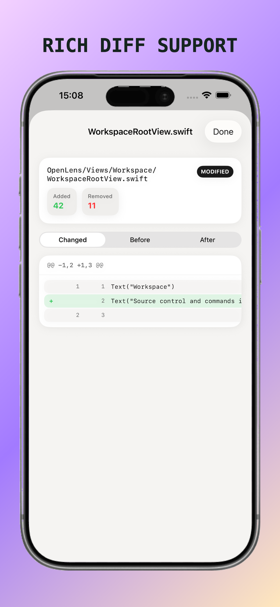

# OpenLens

**iOS companion app for [OpenCode](https://opencode.ai) — chat with your AI coding assistant from your phone.**

<p align="leading">
  <a href="https://apps.apple.com/pl/app/openlens-opencode-client/id6759910797">
    
  </a>
</p>

OpenLens connects to an OpenCode server running on your Mac and gives you a native iPhone and iPad interface to chat, review changes, browse workspace context, answer agent questions, and manage sessions away from the keyboard.

<p align="center">
  
  
  
</p>

<p align="center">
  
  
  
</p>

## Install

- **App Store**: install OpenLens on iPhone or iPad from the App Store using the badge above.
- **From source**: clone the repo, run `xcodegen generate`, then open the generated `OpenLens.xcodeproj` in Xcode 26 or newer.

## Releases

- **iOS app releases**: the primary end-user distribution channel is the App Store.
- **Source builds**: contributors and self-hosters can build from `main` or from tagged revisions in Git.
- **Compatibility**: the repository currently targets iOS/iPadOS 26+ and current OpenCode server behavior on macOS.


## Features

- **Native session chat** — rich Markdown rendering, code blocks, thinking indicators, agent activity cards, permission prompts, and question flows
- **Flexible connection flows** — QR code scan, Bonjour auto-discovery, manual URL entry, saved servers, auto-reconnect, and `openlens://` deep links
- **Session management** — browse, create, delete, switch, and continue existing OpenCode sessions
- **Review tab** — inspect session-wide changes or a single agent update, open diffs, and revert one update without discarding the whole session
- **Workspace tab** — browse files, worktrees, slash commands, and changed files, then request branch switches, pushes, and pull requests through the active session
- **Inbox and insights** — answer pending questions, approve permissions, and inspect local cost, token usage, and model breakdowns for a session
- **Model controls** — switch between AI providers/models and available reasoning variants directly from the app
- **Live Activities** — track agent progress on your Lock Screen and Dynamic Island
- **Demo mode** — try the app without a server to see how it works
- **Setup wizard & onboarding** — guided first-launch experience


## Quick Start

### 1. Install OpenCode on your Mac

```bash
curl -fsSL https://opencode.ai/install | bash
```

### 2. Start the server

```bash
opencode serve --port 4096 --hostname 0.0.0.0
```

Add `--mdns` if you want OpenLens to find the server via Bonjour. Set
`OPENCODE_SERVER_PASSWORD` before starting it to require a password.

### 3. Open OpenLens on your iPhone and connect

- **Scan QR** — run `opencode pair`, tap "Scan QR Code" and point at the terminal
- **Auto-discover** — tap "Tap to scan for nearby servers" (Bonjour; start OpenCode with `--mdns` if you want discovery)
- **Manual** — enter your Mac's IP and port (e.g. `192.168.1.50:4096`)

That's it. You're chatting with your AI coding assistant from your phone.

### Pair with OpenCode v2

Run `opencode pair` on your computer. Paste the resulting
pairing link into OpenLens's server address field and tap **Connect**, or scan
its QR code. OpenLens accepts the current
`http://<host>:<port>/connect#<credentials>` format and legacy
`http://<host>:<port>/auth/connect/<code>` links.

OpenLens resolves the pairing credentials and saves them in Keychain for
subsequent connections. You do not need to enter a password.
Links expire after five minutes and work once; run `opencode pair` again if
the link has expired or was already opened in a browser. If the connection
fails after pairing succeeds, **Try Again** uses the saved token.

Your iPhone must be able to reach the host in the link. A private LAN address
requires access to that network (directly or through a VPN).


## Requirements

- **iOS app**: iPhone or iPad with iOS/iPadOS 26+
- **Server**: macOS with [OpenCode](https://opencode.ai) installed
- **Network**: your iPhone must be able to reach the OpenCode server, for
  example on the same local network or through a VPN


## Project Layout

- `OpenLens/` — main iOS app
- `OpenLensActivityWidget/` — Live Activity widget extension
- `OpenLensTests/` — unit tests


## Development

- **Toolchain**: Xcode 26+, iOS 26 simulator/runtime, macOS, OpenCode installed locally
- **Project generation**: install XcodeGen with `brew install xcodegen`, then run `xcodegen generate`
- **Open the project**: the generated `OpenLens.xcodeproj`
- **Device signing**: if you want to run on your own device, copy `Config/Signing.local.xcconfig.example` to `Config/Signing.local.xcconfig` and replace the team, bundle identifiers, and App Group values with your own

Run the main verification command from the repository root:

```bash
./scripts/test-ios.sh
```

See [CONTRIBUTING.md](CONTRIBUTING.md#verification) for Python 3/tool requirements, simulator selection, focused test runs, time limits, and recovery logs.

## Contributing

See [CONTRIBUTING.md](CONTRIBUTING.md) for setup and PR expectations, [SECURITY.md](SECURITY.md) for vulnerability reporting, and [CODE_OF_CONDUCT.md](CODE_OF_CONDUCT.md) for community guidelines.


## Support And Community

- **Bug reports**: open a GitHub issue with the bug report template and include a clear reproduction path.
- **Feature proposals**: open a GitHub issue with the feature request template when the request is concrete and actionable.
- **Security issues**: use GitHub Private Vulnerability Reporting and follow [SECURITY.md](SECURITY.md).
- **Questions and setup help**: use GitHub Discussions if enabled for this repository; otherwise open a documentation-focused issue only when something in the repo needs to change.


## OpenCode

This project is not built by the OpenCode team and is not affiliated with it in any way.


## Deep Links

OpenLens supports the `openlens://` URL scheme for automated connection:

```
openlens://connect?url=192.168.1.50:4096&user=opencode&pass=optional&sessionID=abc123
```

If `sessionID` is present, OpenLens connects first and then opens that session automatically.

To promote OpenCode v2 support without any server details (for example as an App Store in-app event deep link), use:

```
openlens://setup
```

Without a connection, OpenLens shows connection setup. When it is connected, or reconnecting to the saved server, it shows the OpenCode v2 support screen with the server's detected version instead.


## License

This project is licensed under the [MIT License](LICENSE).
